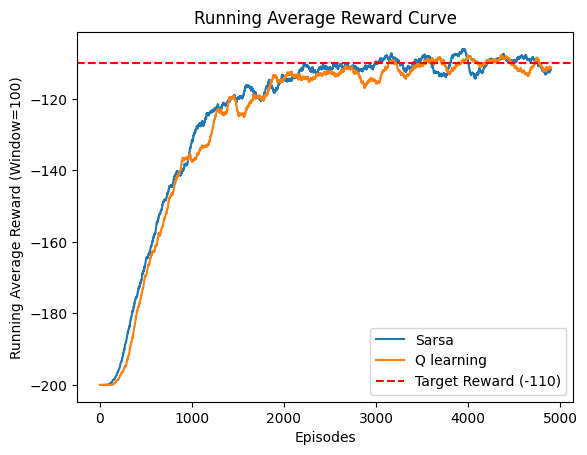
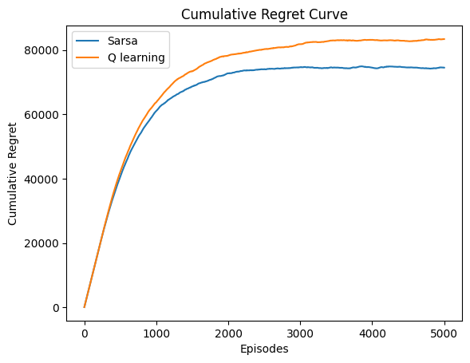

# Mountain Car with Discrete Action Support

This project implements Q-learning with softmax and SARSA epsilon greedy for solving the MountainCar-v0 with discrete action environment with discrete action support. It provides options for using either Q-tables or tiling-based state representation.

## Requirements
To install dependencies, run:
```bash
pip install -r requirements.txt
```

## Usage
Run the script with the following options:
```bash
python mountain_car.py --algo [q_learning | sarsa | both] --type [q_table | tiling]
```

### Command-Line Arguments
| Argument | Type | Default | Description |
|----------|------|---------|-------------|
| `--algo` | str | Required | Algorithm to use: `q_learning`, `sarsa`, or `both`. |
| `--type` | str | Required | State representation method: `q_table` or `tiling`. |
| `--env_name` | str | MountainCar-v0 | Name of the Gym environment. |
| `--n_episodes` | int | 10000 | Number of training episodes. |
| `--pos_bins` | int | 40 | Number of bins for position discretization. |
| `--vel_bins` | int | 40 | Number of bins for velocity discretization. |
| `--n_runs` | int | 5 | Number of runs to average over. |
| `--alpha` | float | 0.1 | Learning rate. |
| `--gamma` | float | 0.99 | Discount factor. |
| `--initial_tau` | float | 10.0 | Initial temperature for softmax. |
| `--tau_decay` | float | 0.995 | Temperature decay rate for softmax. |
| `--min_tau` | float | 0.005 | Minimum temperature for softmax. |
| `--initial_epsilon` | float | 1.2 | Initial epsilon for epsilon-greedy. |
| `--epsilon_decay` | float | 0.999 | Epsilon decay rate. |
| `--min_epsilon` | float | 0.005 | Minimum epsilon value. |
| `--numTilings` | int | 8 | Number of tilings for tile coding. |
| `--numTiles` | int | 10 | Number of tiles per dimension. |

## Output



- **Plots:** Generates and saves plots for mean rewards, running averages, and cumulative regret.
